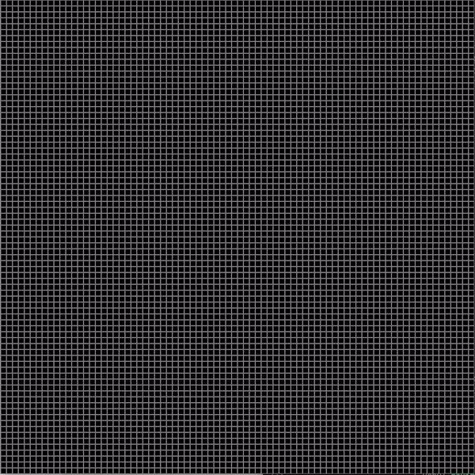
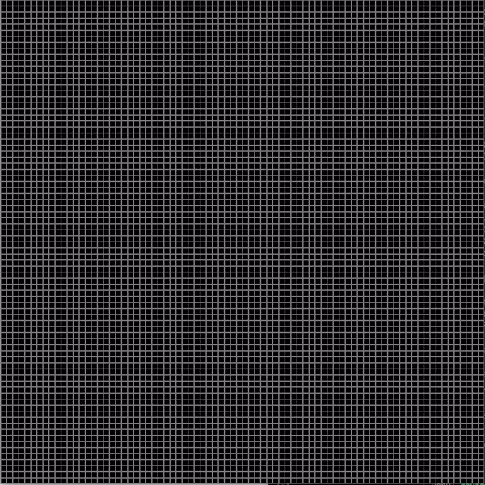

# Falling Sand in Python

This project simulates falling sand using Python. Users can interact with the simulation by adding sand with mouse clicks and controlling the simulation flow.

## Demo

*Normal run of the simulation*


*Pause and resume functionality*


## Features

- Simulates falling sand, and the interaction between the individual grains. 
- Click to add more sand
- Pause and resume functionality
- Adjust FPS during runtime
- Simple, single-file implementation

## Requirements

- Python 3
- PyGame
- NumPy

## Installation

Ensure you have Python 3 installed on your system. Then install the required libraries:

```bash
pip install pygame numpy
```

## Usage

Run the simulation with:
```bash
python3 ./fallingSand.py
```

The simulation starts with a default FPS limit of 60. You can adjust this during runtime using the up and down arrow keys, within a range of 30 to 120 FPS.

## Controls

- **Left mouse click**: Add sand
- **P**: Pause the simulation
- **R**: Resume the simulation
- **ESC**: Quit the application
- **Up Arrow**: Increase FPS limit
- **Down Arrow**: Decrease FPS limit

## FPS Limiting

- **Default**: 60 FPS
- **Minimum**: 30 FPS
- **Maximum**: 120 FPS

Adjusting the FPS can help balance between smooth animation and performance on different systems.

## Future Improvements

While there are no concrete plans for future development, potential improvements could include:

- Adding different colors for sand particles
- Allowing users to change the width of individual sand grains during runtime

## License

This project is open source and available for any use.

## Inspiration

This project is inspired by a YouTube video tutorial on creating a falling sand simulation in JavaScript. The key difference is that this implementation uses Python instead of JavaScript.

Original inspiration: [Coding "Falling Sand" in JavaScript](https://www.youtube.com/watch?v=L4u7Zy_b868)

## Contact

For any questions or feedback, please reach out via email:

dkesslerm@gmail.com